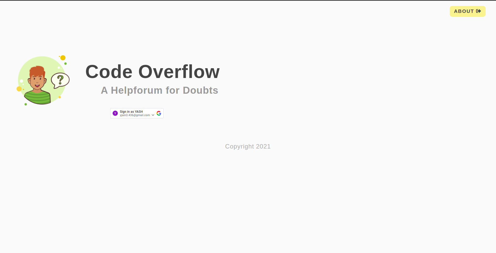
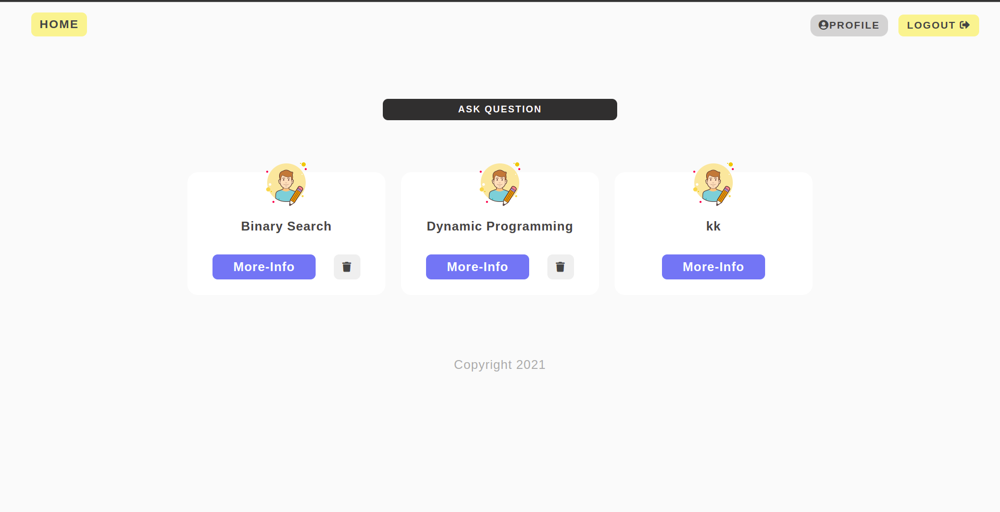
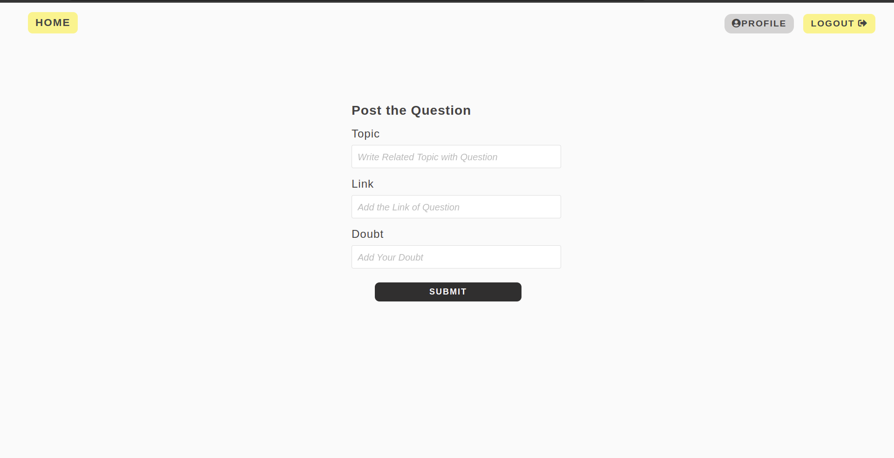
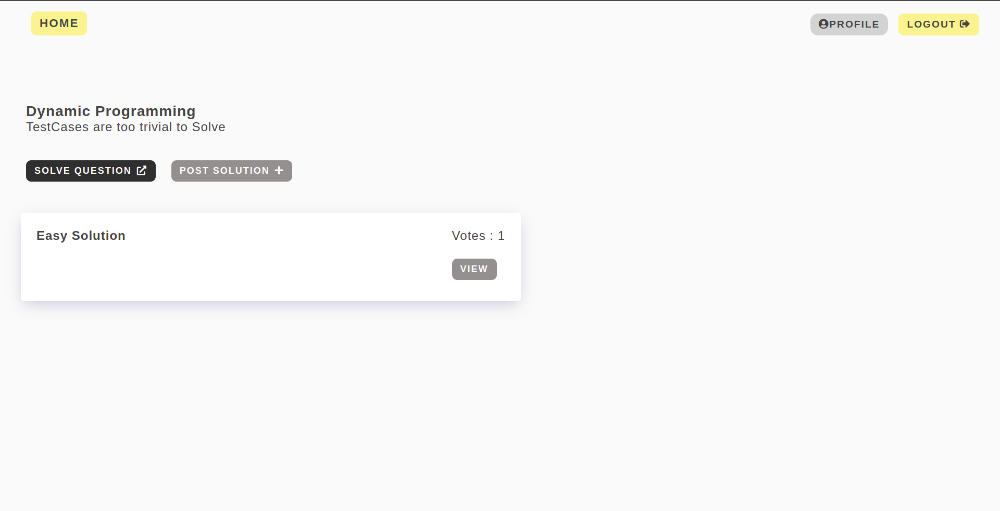
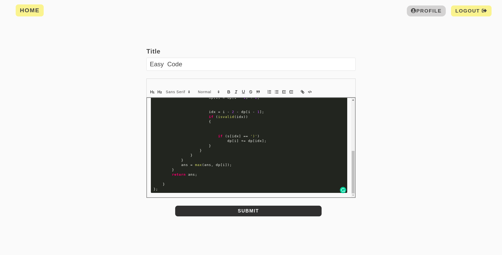
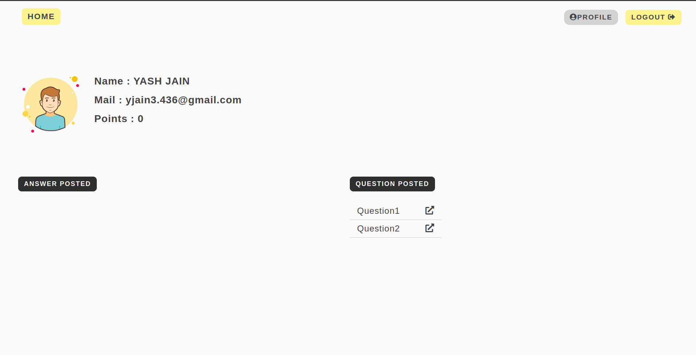

# CodeForum

A Free HelpForum for Programmers and Developers

## Moto Of Creating this Project 
```
So it all started in covid times
Me and my friends were discussing about a coding problems 
No one of us was able to solve a problem or we were having difficulty in 
understanding the problem . 
so there was a need of someone who had solved that problem can help us .
But there was no such platform where we can post the question and get help.

So there I created this  HelpForum WebApplication 
where different user can post their queries regarding coding Problems and get clear their doubts
```
## Main Features :
```
1. simple login and logout using google authentication
2. users can post the ( topic ,link and query regarding the question)
   users of the platform can answer to other user doubts by writing there
   solution in the editor attached.
3. editor provide the functionality of :
   adding code snippets
   adding header and link to a video solution etc.
4. And the other main feature the user can upvote a answer if they like it
5. We can also comment on the answers that were posted by other user.
```

## API - Endpoints

### Authentication

| Type | Route  |     Path Parameters      |    Description     |
| :--: | :----: | :----------------------: | :----------------: |
| POST | /login | body :- req.body.googlId | loging in the User |
| POST | /logut |  body:- req.body.userId  |  logout the User   |

---

### Profile

---

| Type |              Route               |     Path Parameters      |           Description           |
| :--: | :------------------------------: | :----------------------: | :-----------------------------: |
| GET  |         /profile/:userid         |          userId          |   To get the Profile of User    |
| GET  | /profile/:userid/answer/show/:id |  userId , answerid = id  |     To get the User answers     |
| GET  |  /profile/:userid/question/:id   | userId , questionid = id | To get the User Asked Questions |

---

### Questions

---

| Type |                     Route                      |         Path Parameters         |                      Description                      |
| :--: | :--------------------------------------------: | :-----------------------------: | :---------------------------------------------------: |
| GET  |          /questions/:userid/smoothies          |             userId              |         To get All The Questions in the Forum         |
| GET  |     /questions/:userid/UpdateQuestionList      |             userId              |      display a form for creating a new Question       |
| GET  |             /questions/:userid/:id             |      userId ,id=questionId      |          shows more info about one Question           |
| GET  |       /questions/:userid/:id/answer/new        |       userId ,id=answerid       | show text-editor when someone wants to post a Answer  |
| GET  | /questions/:userid/:questionid/answer/show/:id | userId ,questionid, id=answerid |       show detail page for a pariticular answer       |
| POST |     /questions/:userid/UpdateQuestionList      |             userId              |      to add the new Question in database/WebSite      |
| POST |           /questions/:userid/delete            |             userId              |                 to delete a question                  |
| POST |            /:userid/:id/answer/new             |       userId, id=answerId       | to add the new Answer for a question in the Database. |

---

### Answer

---

| Type |              Route              |    Path Parameters    |                  Description                   |
| :--: | :-----------------------------: | :-------------------: | :--------------------------------------------: |
| GET  |    /answer/:userid/show/:id     | userId, id=questionId |   show detail page for a pariticular answer    |
| POST |     /answer/:userid/delete      |        userId         |        to delete a answer of a question        |
| POST |     /answer/:userid/upvote      |        userId         |        to Upvote a answer of a question        |
| POST | /answer/:userid/:id/comment/new |  userId,id=commentId  | to post a new comment for a particular answer. |

---

### Comment

---

| Type |          Route          | Path Parameters |          Description          |
| :--: | :---------------------: | :-------------: | :---------------------------: |
| GET  | /comment/:userid/delete |     userId      | To delete a Comment By a User |

## Tech Used

- NodeJs
- ExpressJs

---

### HomePage of Web-Application :



### All Question Screen



### Adding Question Screen :



### Display Questions and Related Answers :



### Adding Answer to a Question :



### Profile Page of a User :



---

### How To run the Project :

1. npm init
2. install all dependencies - npm install

```

body-parser
cookie-parser
ejs
express
mongoose

```

3. nodemon : npm install nodemon -g
4. changes to be made : in package.json file

```
"scripts": {
    "start": "node app.js",
    "devStart": "nodemon app.js",
    "test": "echo \"Error: no test specified\" && exit 1"
  }
```

5. to run server : npm run devStart

## Terms

```
1. requireAuth :
means Authentication is required before accessing any page.
user will not be allowed to enter any sort of information before loging the system

```

---

### Working Snippet of Project :

[LINK TO SNIPPET]

---

### Some Doubts that I face during working on this project:
